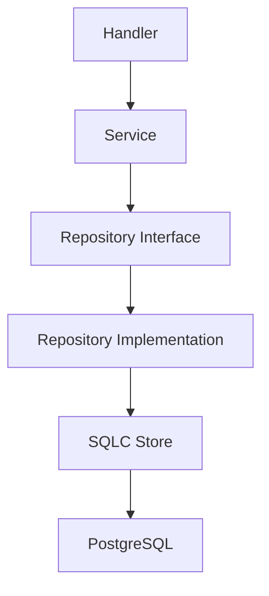
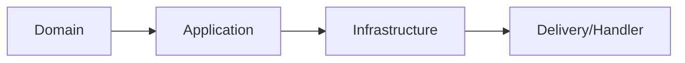
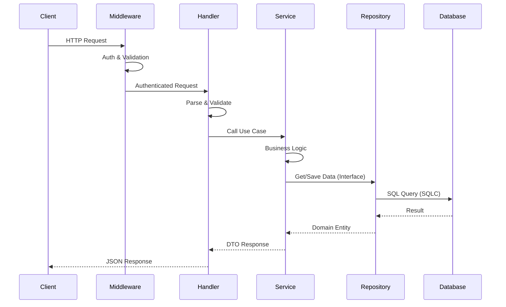
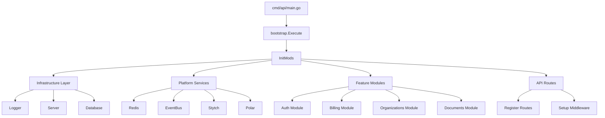
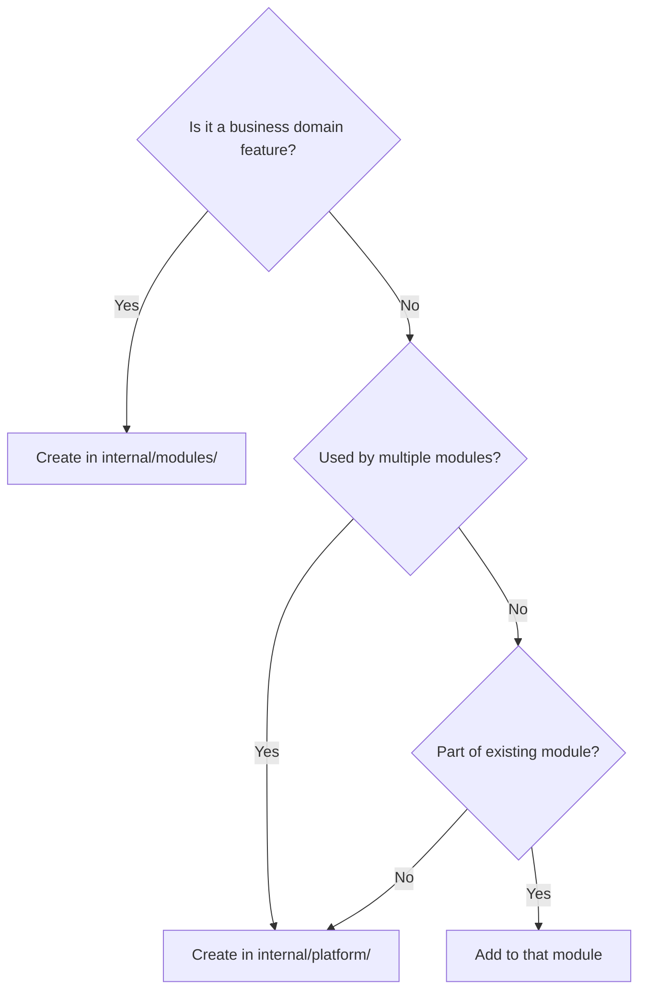

# Backend Architecture

The backend is a **Modular Monolith** using **idiomatic Go project layout** with Clear separation between business features and infrastructure.

## High-Level Structure

```
go-b2b-starter/
├── cmd/                  # Application entry points
│   └── api/
│       └── main.go       # Main entry point
│
├── internal/             # Private application code (import boundary)
│   ├── modules/          # Feature modules (business domains)
│   ├── platform/         # Cross-cutting infrastructure
│   ├── db/               # Database layer (SQLC, DI registration)
│   ├── bootstrap/        # Application initialization
│   └── api/              # API route registration
│
├── pkg/                  # Public reusable packages
│   ├── httperr/          # HTTP error types
│   ├── pagination/       # Pagination helpers
│   └── response/         # API response utilities
│
└── go.mod                # Single consolidated module
```

## Architectural Layers

### Feature Modules (`internal/modules/`)

Business domain modules following **Clean Architecture**. Each module represents a distinct business capability:

```
internal/modules/
├── auth/             # Authentication & RBAC
├── billing/          # Polar.sh subscriptions & quota management
├── organizations/    # Multi-tenant organization management
├── documents/        # PDF document processing
├── cognitive/        # RAG (Retrieval-Augmented Generation) & embeddings
├── files/            # File storage (R2 + metadata)
└── paywall/          # Subscription middleware
```

**Characteristics of Feature Modules:**
- Business domain logic
- Domain entities with business rules
- API endpoints
- Use cases and workflows
- Follow Clean Architecture layers (domain → app → infra)

### Platform Services (`internal/platform/`)

Cross-cutting infrastructure components used by multiple modules:

```
internal/platform/
├── server/           # HTTP server & middleware
├── eventbus/         # Event pub/sub system
├── logger/           # Structured logging
├── redis/            # Redis cache client
├── stytch/           # Stytch auth provider client
├── polar/            # Polar.sh billing provider client
├── llm/              # LLM integration (OpenAI)
└── ocr/              # OCR service (Mistral)
```

**Characteristics of Platform Components:**
- Infrastructure concerns
- Used by multiple modules
- No business logic
- Provide technical capabilities

### Database Layer (`internal/db/`)

Centralized database layer using SQLC:

```
internal/db/
├── postgres/
│   ├── sqlc/
│   │   ├── migrations/    # SQL migration files
│   │   ├── query/         # SQL queries with SQLC annotations
│   │   └── gen/          # Generated Go code
│   └── postgres.go       # DB connection and pooling
├── inject.go             # DI registration for all repositories
└── core/
    └── errors.go         # Database error types
```

**Key Responsibilities:**
- SQLC code generation
- Repository DI registration
- Database connection management
- Transaction support

## Module Structure (Clean Architecture)

Each feature module in `internal/modules/` follows **Clean Architecture**:



### Layer Details

```
internal/modules/billing/
├── cmd/                  # Module initialization (DI wiring)
│   └── init.go
│
├── app/                  # Application Layer (Use Cases)
│   └── services/
│       └── billing_service.go
│
├── domain/               # Domain Layer (Core Business Logic)
│   ├── entity.go         # Data structures
│   ├── repository.go     # Interface definitions
│   ├── errors.go         # Domain errors
│   └── events/           # Domain events
│
├── infra/                # Infrastructure Layer (External)
│   ├── repositories/     # Repository implementations
│   │   └── subscription_repository.go
│   └── polar/           # Polar.sh adapter
│       └── polar_adapter.go
│
├── handler.go            # HTTP handlers (Delivery Layer)
├── routes.go             # Route registration
└── module.go             # Dependency injection setup
```

## Key Principles

### 1. `internal/` Boundary

Code in `internal/` cannot be imported by external packages. This enforces encapsulation and prevents unintended dependencies.

### 2. Dependency Rule (Clean Architecture)



**Direction of dependencies:**
- Domain → Nothing (pure business logic)
- Application → Domain (uses domain interfaces)
- Infrastructure → Domain (implements domain interfaces)
- Handlers → Application (calls services)

**Key Point**: Inner layers never depend on outer layers. Infrastructure implements interfaces defined in domain.

### 3. Feature-Based Organization

Modules are organized by **business feature** (billing, auth, organizations), not by technical layer (controllers, services, models).

This promotes:
- High cohesion within features
- Low coupling between features
- Easy to understand and navigate
- Clear ownership and boundaries

### 4. Single `go.mod`

One module for the entire project eliminates workspace complexity and simplifies dependency management.

## Request Flow



### Flow Breakdown

1. **Client Request**: HTTP request arrives at server
2. **Middleware**: Auth, logging, rate limiting, CORS
3. **Handler**: Parse request, extract context (org ID, user ID)
4. **Service**: Execute business logic, orchestrate operations
5. **Repository**: Data access using domain interfaces
6. **Database**: SQLC-generated type-safe queries

## Initialization Flow



### Initialization Order (Critical)

```
cmd/api/main.go
    └── bootstrap.Execute()
        ├── 1. Infrastructure (no dependencies)
        │   ├── logger.Inject()
        │   ├── server.Inject()
        │   └── db.Inject()              # Registers all domain repositories
        │
        ├── 2. Platform Services
        │   ├── redis.Inject()
        │   ├── llm.Inject()
        │   ├── ocr.Inject()
        │   ├── polar.Inject()
        │   └── eventbus.Inject()
        │
        ├── 3. Feature Modules (order matters!)
        │   ├── files.SetupDependencies()
        │   ├── auth.SetupDependencies()
        │   ├── organizations.RegisterDependencies()
        │   ├── billing.Configure()
        │   ├── cognitive.RegisterDependencies()
        │   └── documents.RegisterDependencies()
        │
        ├── 4. Event Subscriptions
        │   └── cognitive.SetupEventSubscriptions()
        │
        └── 5. HTTP Server Setup
            ├── server.SetupMiddleware()
            └── api.RegisterRoutes()
```

**Why Order Matters:**
- `db.Inject()` must run early (registers all repositories)
- `auth` must be before modules that need auth middleware
- `files` must be before `documents` (documents depend on files)
- Event subscriptions must be after all modules are loaded

## Dependency Injection

The project uses **uber-go/dig** for dependency injection:

```go
// 1. Define interface in domain
package domain
type ProductRepository interface {
    Create(ctx context.Context, p *Product) (*Product, error)
}

// 2. Implement in infrastructure
package repositories
func NewProductRepository(store sqlc.Store) domain.ProductRepository {
    return &productRepository{store: store}
}

// 3. Register in DI (internal/db/inject.go)
container.Provide(func(sqlcStore sqlc.Store) productDomain.ProductRepository {
    return productRepos.NewProductRepository(sqlcStore)
})

// 4. Inject into service
package services
func NewProductService(repo domain.ProductRepository) ProductService {
    return &productService{repo: repo}
}
```

**Benefits:**
- Automatic dependency resolution
- Easy testing (inject mocks)
- Clear dependency graph
- Compile-time safety

## Modules vs Platform Decision



### Examples

| Component | Location | Reason |
|-----------|----------|--------|
| Product Catalog | `modules/products/` | Business domain feature |
| Invoice Processing | `modules/invoices/` | Business domain feature |
| Subscription Management | `modules/billing/` | Business domain feature |
| Event Bus | `platform/eventbus/` | Used by all modules |
| Logging | `platform/logger/` | Cross-cutting infrastructure |
| Stytch Client | `platform/stytch/` | Auth provider client |
| Auth Module | `modules/auth/` | Business auth logic using Stytch |

## Communication Between Modules

Modules communicate through:

### 1. Event Bus (Loosely Coupled)

```go
// Module A publishes event
eventBus.Publish(ctx, events.NewDocumentUploadedEvent(docID, orgID))

// Module B subscribes
eventBus.Subscribe("document.uploaded", func(ctx context.Context, event Event) error {
    docEvent := event.(*DocumentUploadedEvent)
    return embeddingService.GenerateForDocument(ctx, docEvent.DocumentID)
})
```

**Use When:**
- Asynchronous operations
- One-to-many communication
- Loose coupling desired

### 2. Direct Service Injection (Tightly Coupled)

```go
// Service A uses Service B
func NewInvoiceService(
    repo domain.InvoiceRepository,
    billingService billing.BillingService,  // Direct dependency
) InvoiceService {
    return &invoiceService{
        repo: repo,
        billing: billingService,
    }
}
```

**Use When:**
- Synchronous operations
- One-to-one communication
- Strong dependency relationship

### 3. Shared Platform Components

```go
// Multiple modules use platform logger
func NewDocumentService(
    repo domain.DocumentRepository,
    logger logger.Logger,  // Platform component
) DocumentService {
    return &documentService{repo: repo, logger: logger}
}
```

## Multi-Tenancy

Every module supports multi-tenancy through **Organization ID**:

```go
// Organization context in middleware
type RequestContext struct {
    OrganizationID int32  // From JWT token
    AccountID      int32  // User account ID
    Identity       *Identity
}

// Used in handlers
reqCtx := auth.GetRequestContext(c)
products, err := service.ListByOrganization(ctx, reqCtx.OrganizationID)

// Enforced in repository
SELECT * FROM products WHERE organization_id = $1 AND id = $2
```

**Benefits:**
- Data isolation per organization
- Single database for all tenants
- Efficient resource usage
- Simplified deployment

## File Structure Summary

| Layer | Path | Purpose |
|-------|------|---------|
| Entry point | `cmd/api/main.go` | Application startup |
| Feature modules | `internal/modules/*/` | Business domains |
| Platform services | `internal/platform/*/` | Infrastructure |
| Database layer | `internal/db/` | SQLC, migrations, DI |
| Bootstrap | `internal/bootstrap/` | Initialization |
| API routes | `internal/api/` | Route registration |
| Shared utilities | `pkg/*/` | Public packages |

## Next Steps

- **Adding a Module**: See [Adding a Module Guide](./adding-a-module.md)
- **Database Operations**: See [Database Guide](./database.md)
- **API Development**: See [API Development Guide](./api-development.md)
- **Authentication**: See [Authentication Guide](./authentication.md)
- **Event Bus**: See [Event Bus Guide](./event-bus.md)
